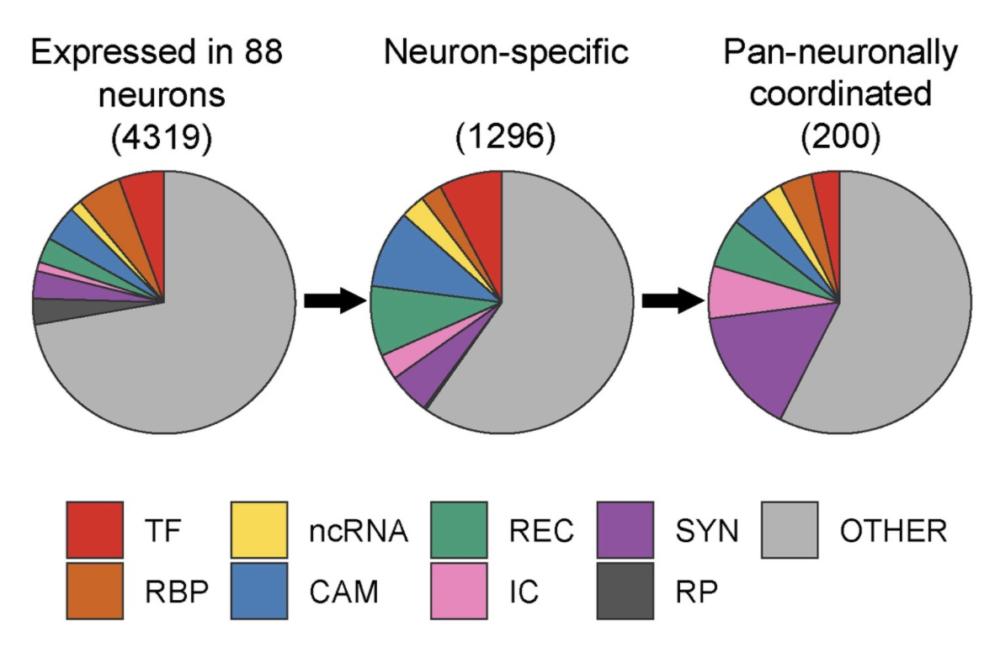

I read one paper published in 2020, [Transcriptional Programs of Circuit Assembly in the Drosophila Visual System](https://www.sciencedirect.com/science/article/pii/S0896627320307741)

In their Fig.4A, there is a nice gene category pie chart.

- ribosomal genes (RP)

- transcriptions factors (TFs)

- RNA-binding proteins (RBPs)

- non-coding RNA (ncRNA)

- cell adhesion molecules (CAMs)

- receptors and ligands (RECs) 

- ion channels (ICs)

- synaptic proteins (SYNs)

  



> (A) Distribution of genes in different categories expressed in neurons (left), enriched in neurons compared to glia (neuron-specific) (middle), and coordinated in a pan-neuronal fashion (right). Functional categories are color coded, including transcriptions factors (TFs), RNA-binding proteins (RBPs), non-coding RNA (ncRNA), cell adhesion molecules (CAMs), receptors and ligands (RECs), ion channels (ICs), synaptic proteins (SYNs), and ribosomal genes (RP).


In their method section, they detailed how to assign genes to different categories:

> Functional categories of genes
> We defined several functional categories of genes. Some genes could be classified into more than one category. Thus, classification was performed sequentially, and every gene was assigned to only one category (e.g., gene classified as ‘‘ion channel’’ cannot be classified as ‘‘synaptic genes,’’ see below). Gene classifications were based on gene groups (GG) and gene ontology (GO) annota- tions obtained from FlyBase (release 6.29). Annotations for cell adhesion molecules were obtained from FlyXCDB (http://prodata. swmed.edu/FlyXCDB; Pei et al., 2018). Functional categories were defined in following order: (1) ribosomal proteins (from GG); (2) transcription factors (from GG); (3) RNA binding proteins (from GO, term GO:0003723; excluding ribosomal proteins (GG), translation factors (GG) and tRNA genes (GG)); (4) non-coding RNA genes (based on gene annotations); (5) cell adhesion molecules (from FlyXCDB, protein domains: Ig, EGF, LRR, fn3, Cadherin); (6) receptor and ligands (from GG, groups: ‘‘transmembrane receptors,’’ ‘‘receptor ligands’’). (7) ion channels (from GG); (8) synaptic genes (from GO, GO:0007268).

This motivates me to generate a gene category file myself, see below.
As this procedure requires information from FlyBase gene group information, which can be found [here](https://github.com/mingwhy/bioinfo_homemade_tools/tree/main/FlyBase_gene.groups) and [FlyXCDB database](https://github.com/mingwhy/bioinfo_homemade_tools/tree/main/FlyXCDB).

Functional categories: 
(1) ribosomal proteins (from GG); 
(2) transcription factors (from GG); 
(3) RNA binding proteins (from GO, term GO:0003723; 
    excluding ribosomal proteins (GG), translation factors (GG) and tRNA genes (GG)); 

(4) non-coding RNA genes (based on gene annotations); 
(5) cell adhesion molecules (from FlyXCDB, protein domains: Ig, EGF, LRR, fn3, Cadherin); 
(6) receptor and ligands (from GG, groups: ‘transmembrane receptors’,‘receptor ligands’). 
(7) ion channels (from GG); 
(8) synaptic genes (from GO, GO:0007268).

```
$ grep 'RIBOSOMAL PROTEINS' ../FlyBase_gene.groups/gene_to_all_its_groups.txt | cut -f1 | sort | uniq >ribosomal_proteins.txt

$ grep 'TRANSCRIPTION FACTORS' ../FlyBase_gene.groups/gene_to_all_its_groups.txt  | cut -f1 | sort | uniq >transcription_factors.txt

$ grep 'TRANSLATION FACTORS' ../FlyBase_gene.groups/gene_to_all_its_groups.txt  | cut -f1 | sort | uniq >translation_factors.txt

$ grep 'TRNA' ../FlyBase_gene.groups/gene_to_all_its_groups.txt | cut -f1 | sort | uniq >tRNA_genes.txt

$ grep 'TRANSMEMBRANE RECEPTORS' ../FlyBase_gene.groups/gene_to_all_its_groups.txt  | cut -f1 | sort | uniq >transmembrane_receptors.txt

$ grep 'RECEPTOR LIGANDS' ../FlyBase_gene.groups/gene_to_all_its_groups.txt  | cut -f1 | sort | uniq >receptor_ligands.txt

$ grep 'ION CHANNELS' ../FlyBase_gene.groups/gene_to_all_its_groups.txt | cut -f1 | sort | uniq >ion_channels.txt

$ cut -f1 ../FlyXCDB/fly_cell.adhesion.molecules.txt | sort | uniq >CAM_cell.adhesion.molecules.txt
```

Then, run R script `assign_fly.genes_to_functional_categories.R` generates three files:
*GO_non-coding_RNA.genes.txt*, *GO_RNA_binding_proteins.txt*, and *GO_synaptic.genes.txt*.


Finally, integrate information into file *functional_categories_of_genes.txt*.
```
$perl integrate.information.pl >functional_categories_of_genes.txt
$wc -l functional_categories_of_genes.txt 
    3884 functional_categories_of_genes.txt
$cut -f1 functional_categories_of_genes.txt | sort | uniq | wc -l
    3884
    
```


